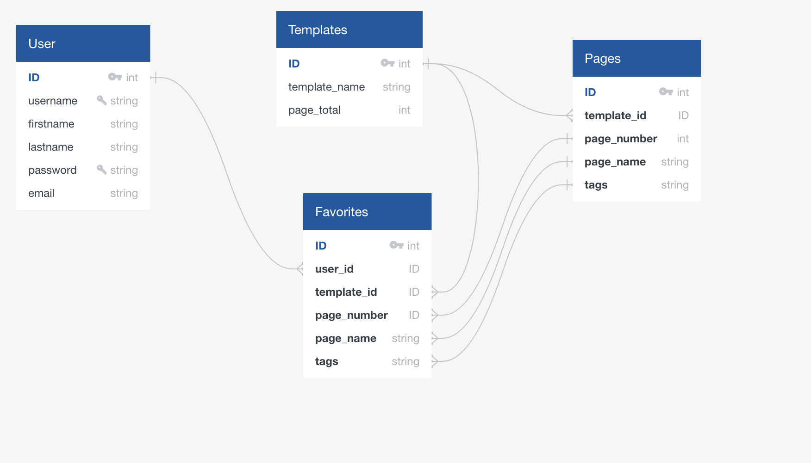
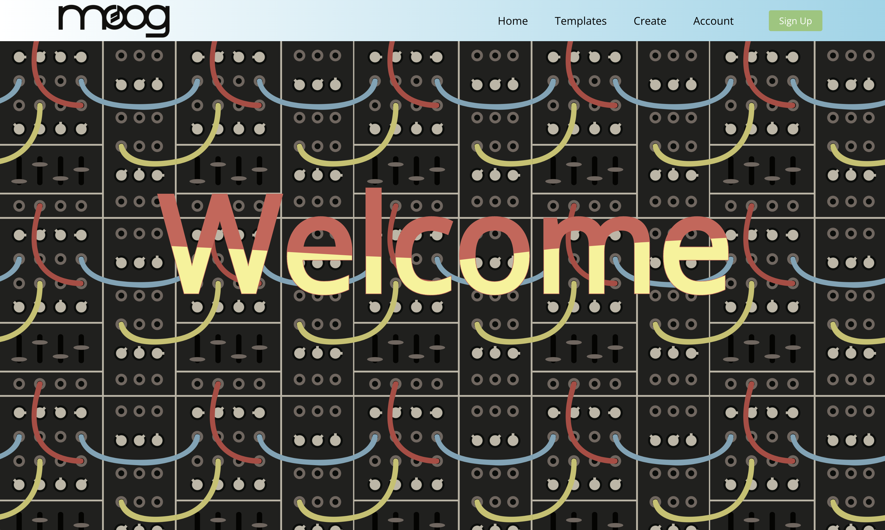

# Moog React Node Express Patchbook Application

This project was bootstrapped with [Create React App](https://github.com/facebook/create-react-app).
in addition of Node Express JS and PosgreSQL

## Demo
* No need to signup, you can login with the following credentials:

  
 username | password     | email  
  
testuser | testpassword | test@test.com

## Database Schema

## Homepage

## User Flow

* Users can Signup/Login with a Username, Email (No Contact), and Password. Password is cryptographically hashed with bcrypt and Users are generated jwt for authenticaion through user routes.

* Users can view templates and preview audio of each patch to hear results

* Users can click external links to visit Moog's website for product and MetaPatch to create patches of their own.

In the project directory, you can run:

### `npm start`

Runs the app in the development mode.\
Open [http://localhost:3000](http://localhost:3000) to view it in your browser.

The page will reload when you make changes.\
You may also see any lint errors in the console.

